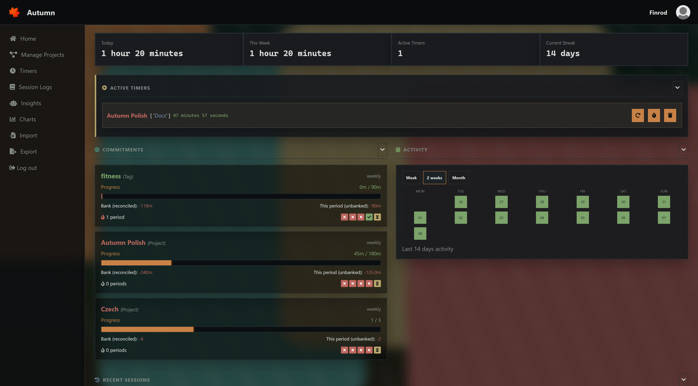
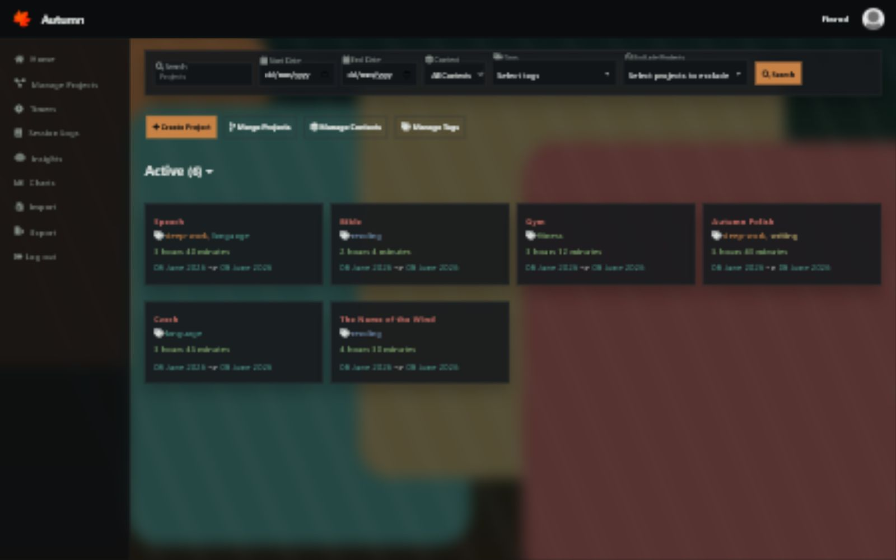
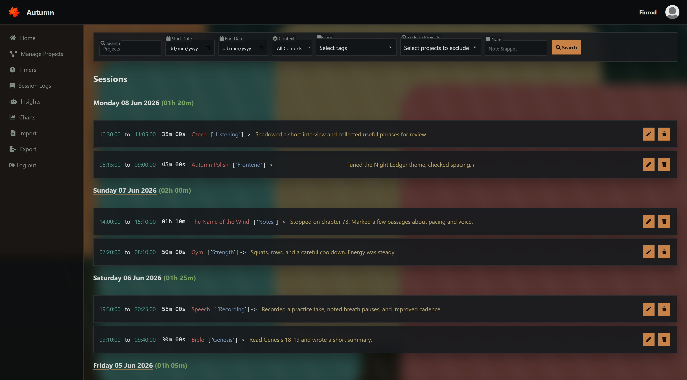
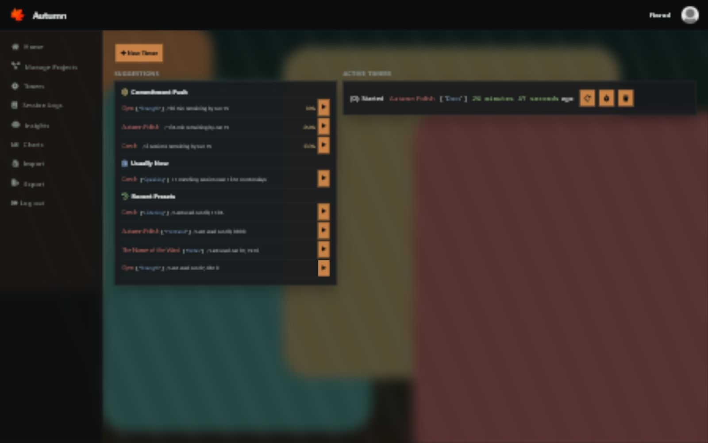
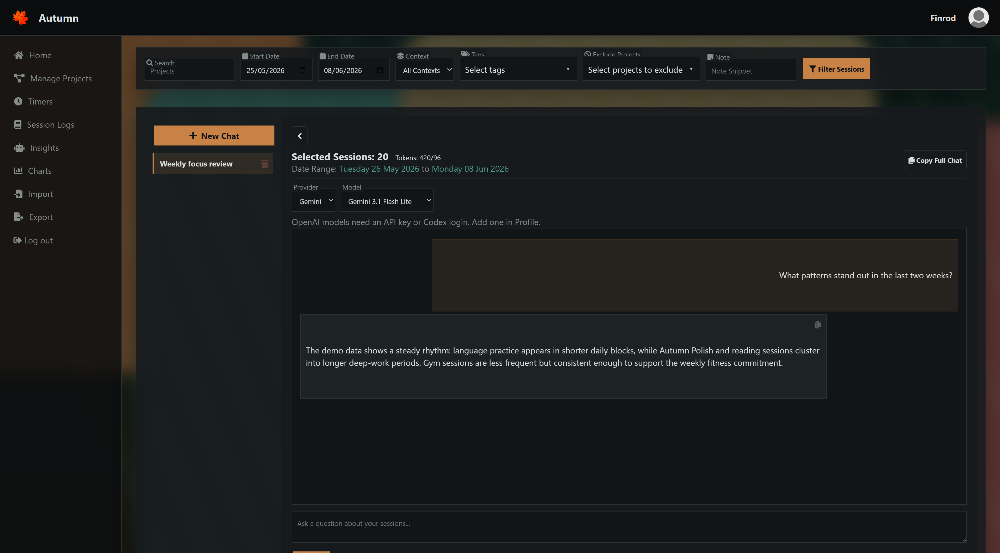
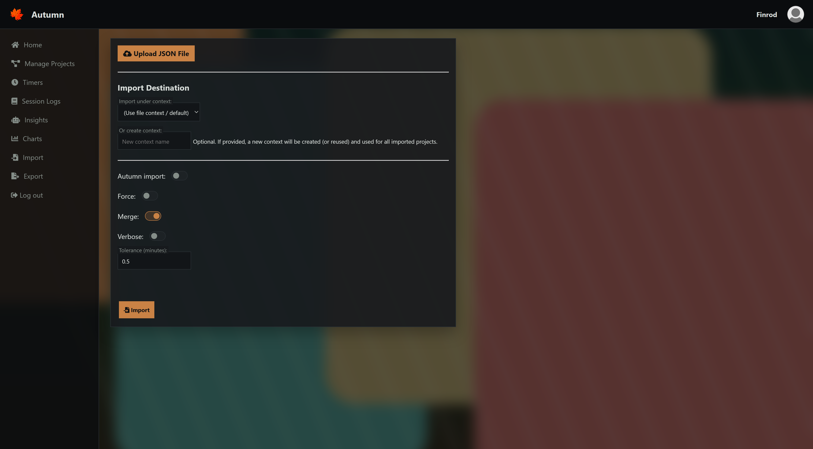
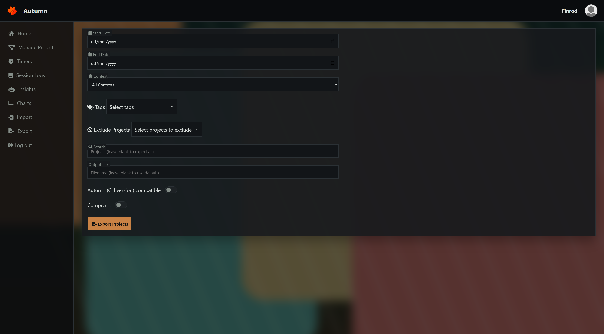
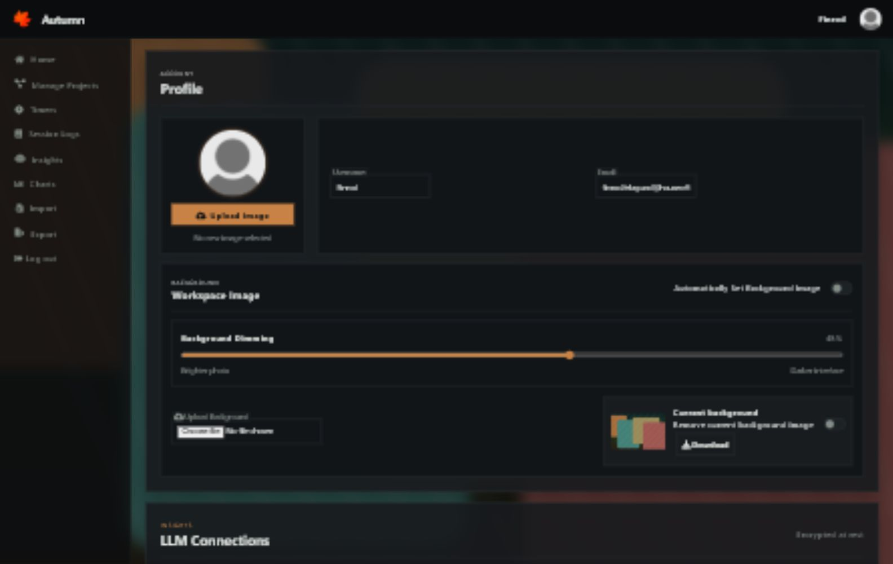
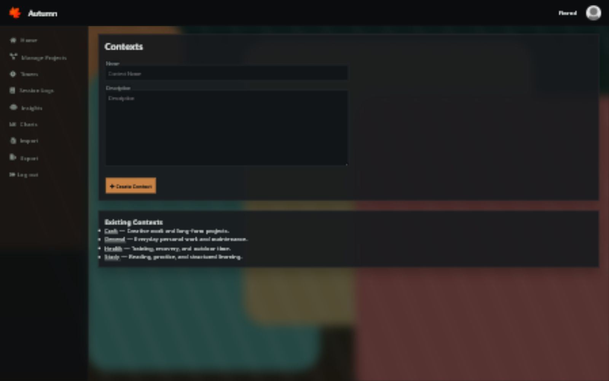
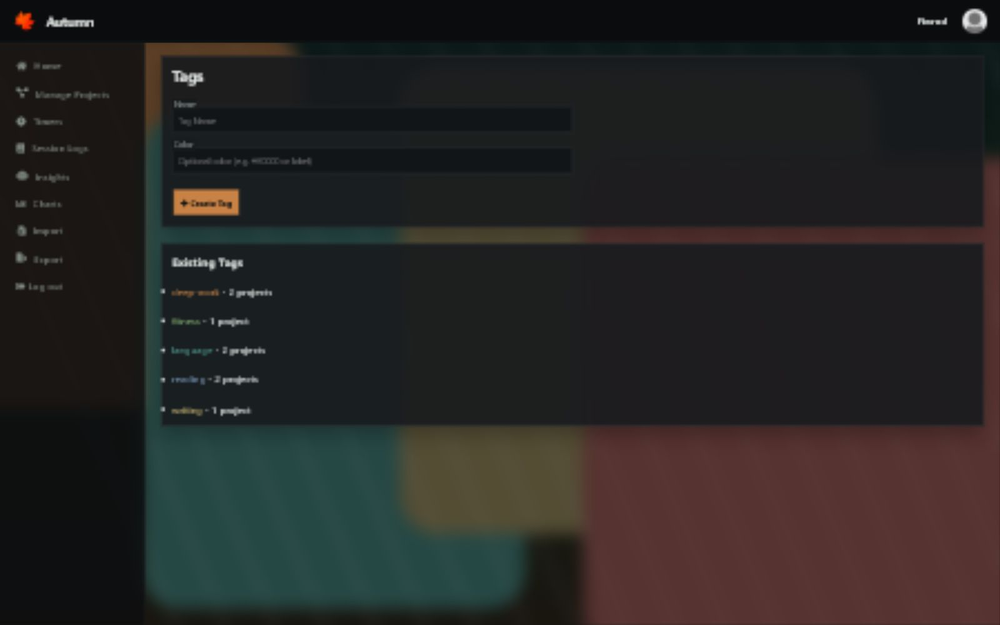

## 🍁 Autumn 

A minimalist, web-based time and project tracking tool.

**Autumn** is a Django application that lets you track how you spend your time across projects and subprojects, view your session history, and visualize your data through charts, heatmaps, and word clouds. It also includes an optional LLM-powered "Insights" feature, where you can ask questions about your session data using natural language.

This project builds on the original [Autumn CLI](https://github.com/Fingolfin7/Autumn), offering a browser-accessible alternative with the same core structure and import/export compatibility.
---

### Try It

A demo is available here:
https://autumn-lg0b.onrender.com/

Use this demo account to explore the features:
- **Username**: `Finrod`
- or **Email**: `finrod.felagund@houseoffinwe.ea`
- **Password**: `autumnweb`

The instance runs on Render and may sleep between requests.

---

### Screenshots

**Home**


**Projects**


**Session Logs**


**Timers**


**Insights**


**Import**


**Export**


**Profile**


**Contexts**


**Tags**


### Chart Types

**Pie**


**Bar**


**Scatter**


**Line**


**Calendar**


**Heatmap**


**Stacked Area**


**Cumulative**


**Treemap**


**Status**


**Context**


**Histogram**


**Radar**


**Tag Bubble**


**Wordcloud**


---

### Features

* Track time spent on projects and subprojects
* Start and stop timers directly in the browser
* Browse and search session history, with the ability to exclude specific projects from results
* Visualize data with charts, scatter plots, and heatmaps (via Chart.js)
* Generate word clouds from session notes
* Export and import data in JSON format (compatible with the old CLI version)
* Ask natural language questions about your data with LLM integration (optional)
* Light and dark themes, with optional Bing daily wallpaper

---

### Local Setup

To run the project locally:

```bash
git clone https://github.com/Fingolfin7/AutumnWeb.git
cd AutumnWeb
python -m venv venv
source venv/bin/activate  # or `venv\Scripts\activate` on Windows
pip install -r requirements.txt
python manage.py migrate
python manage.py shell -c "exec(open('scripts/seed_finrod.py', 'r', encoding='utf-8').read())"
python manage.py runserver
```

Optional:

```bash
python manage.py createsuperuser  # For admin access
```

Access the app at `http://127.0.0.1:8000/`

---

### Tech Stack

* **Backend**: Django, Django REST Framework, SQLite
* **Frontend**: HTML/CSS/JS (jQuery), Chart.js, wordcloud2.js
* **LLM**: Gemini API integration with in-memory handlers
* **Import/Export**: JSON-based, compatible with Autumn CLI
* **No analytics or tracking**

---

### API Docs

See `docs/api.md` for a reference of `/api/*` endpoints (used by the CLI wrapper).

---

> Built with care. Use it if it's useful to you.