# Autumn

A minimalist, web-based time and project tracking tool.

**Autumn** is a Django application for tracking time across projects and subprojects, reviewing session history, managing commitments, and visualizing activity through charts, heatmaps, and word clouds. It also includes an optional LLM-powered **Insights** workspace for asking natural-language questions about your session data.

This project builds on the original [Autumn CLI](https://github.com/Fingolfin7/Autumn), offering a browser-accessible alternative with the same core structure and import/export compatibility.

---

### Try It

A demo is available here:
[https://autumn-lg0b.onrender.com/](https://autumn-lg0b.onrender.com/)

Use this demo account to explore the features:

- **Username**: `Finrod`
- or **Email**: `finrod.felagund@houseoffinwe.ea`
- **Password**: supplied privately by the instance owner

The instance runs on Render and may sleep between requests.

---

### Screenshots

**Home and Commitments**
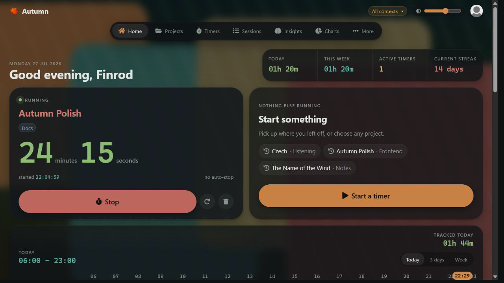

**Session Logs**
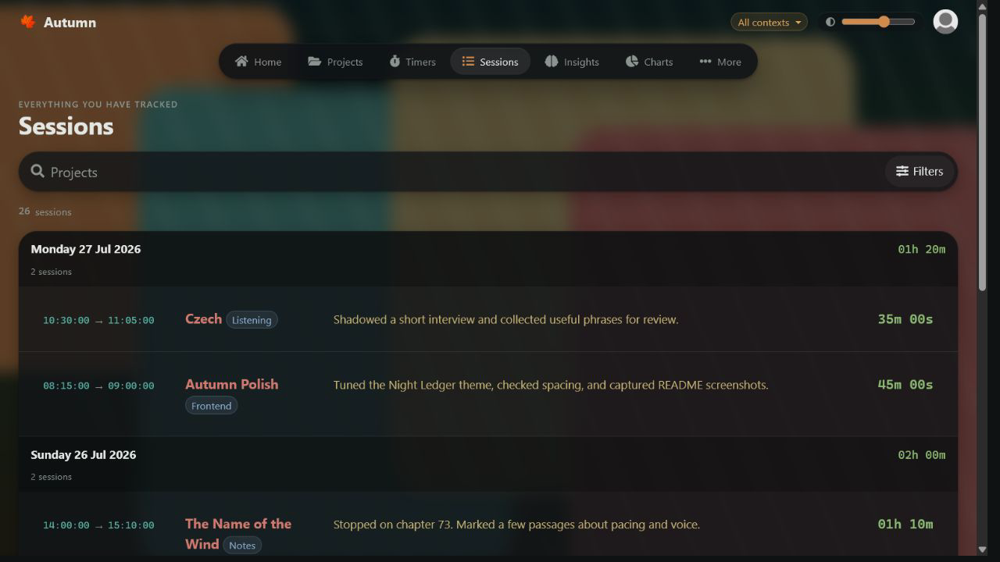

**Timers**
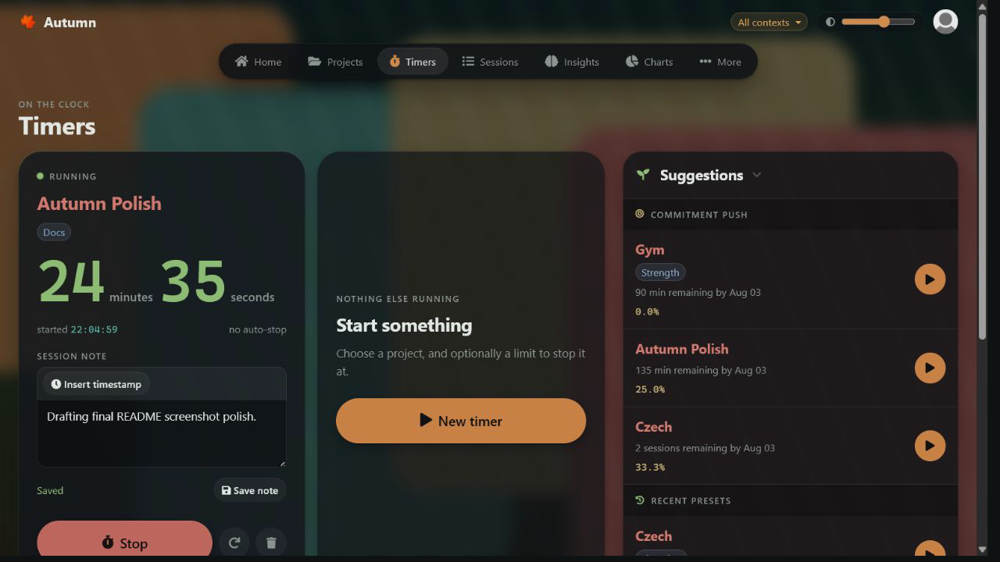

**Projects**
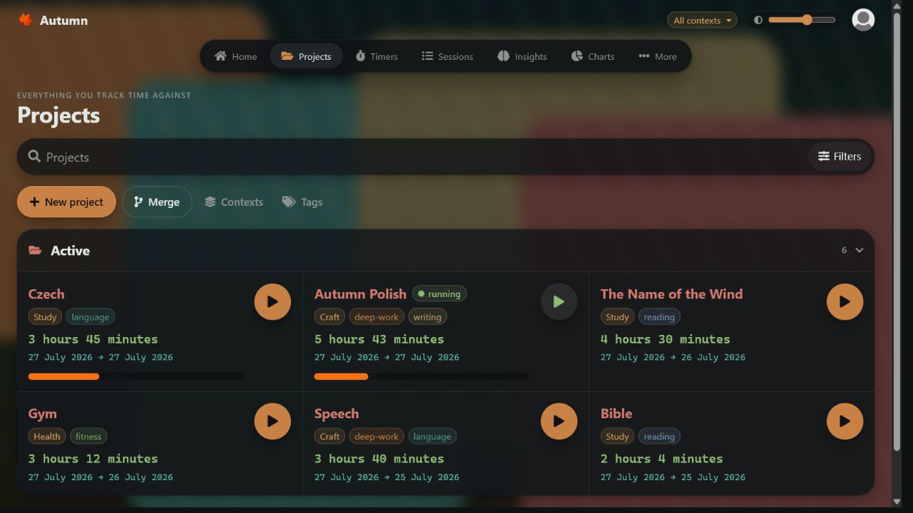

**Contexts**
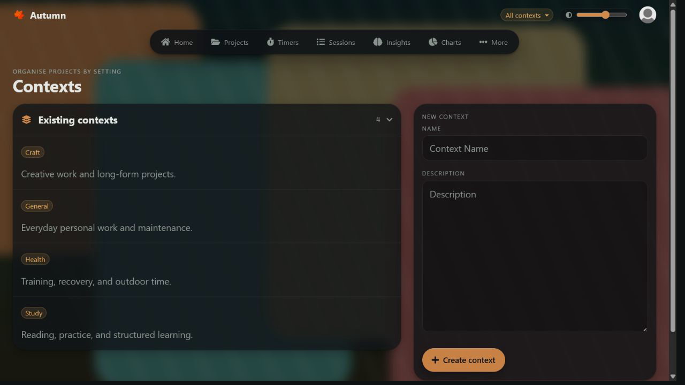

**Tags**
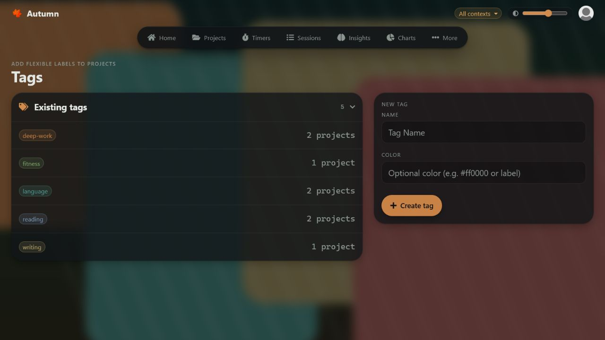

**Insights**
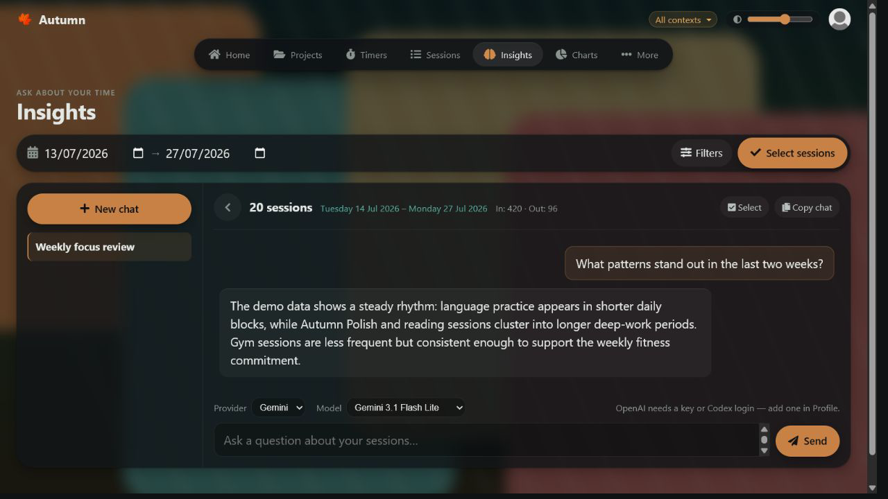

**Import**
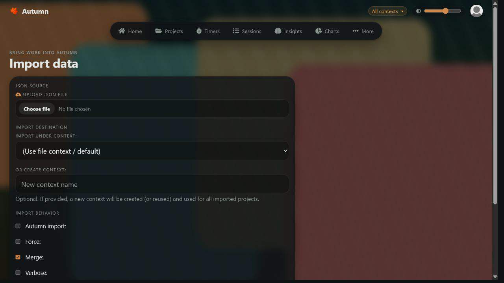

**Export**
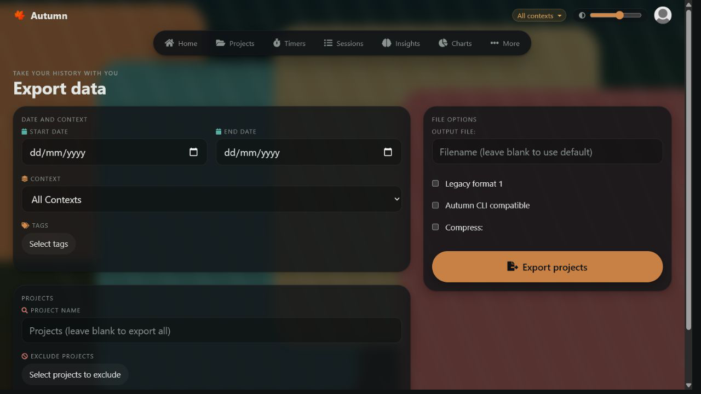

**Profile**
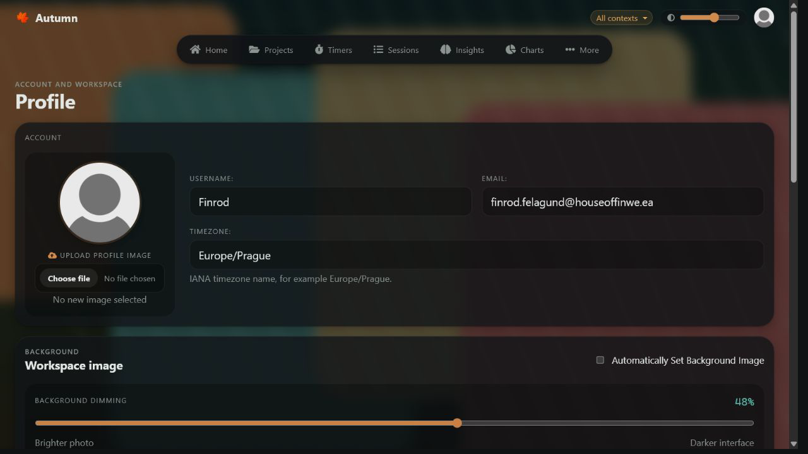

### Chart Tour

Autumn includes pie, bar, scatter, line, calendar, heatmap, stacked area, cumulative, treemap, status, context, histogram, radar, tag bubble, and word cloud charts.

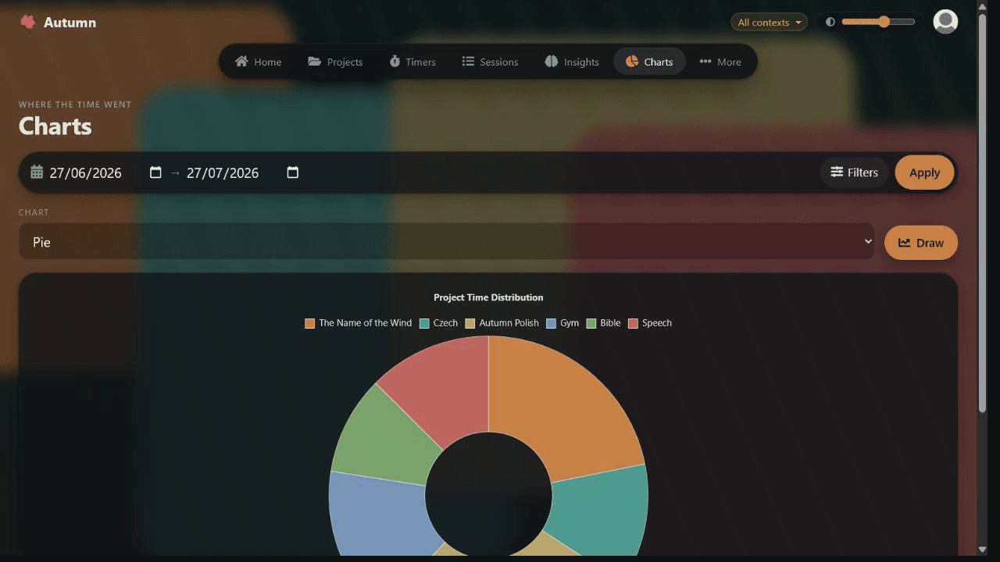

---

### Features

* Track time spent on projects and subprojects
* Start, stop, restart, and remove timers directly in the browser, with optional server-side auto-stop deadlines
* Browse and search session history, including context, tag, date, note, and excluded-project filters
* Organize projects by hard **contexts** and soft **tags**
* Create time-based or session-based commitments with weekly/monthly/etc. targets and banking, in the browser or API
* Visualize data with Chart.js charts, scatter plots, heatmaps, treemaps, and word clouds
* Export and import JSON data compatible with the old CLI version, including JSON import through the API
* Ask natural-language questions about selected sessions with optional LLM integration
* Dark Night Ledger interface with optional custom, Bing, or NASA APOD workspace backgrounds

---

### Local Setup

To run the project locally:

```bash
git clone https://github.com/Fingolfin7/AutumnWeb.git
cd AutumnWeb
python -m venv venv
source venv/bin/activate  # or `venv\Scripts\activate` on Windows
pip install -r requirements.txt
python manage.py migrate
# Set FINROD_PASSWORD in your shell before running the seed command.
python manage.py shell -c "exec(open('scripts/seed_finrod.py', 'r', encoding='utf-8').read())"
python manage.py runserver
```

Optional:

```bash
python manage.py createsuperuser  # For admin access
```

Access the app at `http://127.0.0.1:8000/`.

### Browser timer reminders

Browser reminders use Web Push and are optional. Configure the deployment with
the VAPID public key, private key, and a `mailto:` subject:

```text
PUSH_VAPID_PUBLIC_KEY=<base64url public key>
PUSH_VAPID_PRIVATE_KEY=<private key secret>
PUSH_VAPID_SUBJECT=mailto:admin@example.com
# Optional comma-separated additions/replacements for browser push providers:
PUSH_ALLOWED_ENDPOINT_SUFFIXES=fcm.googleapis.com,push.services.mozilla.com,notify.windows.com,push.apple.com
```

Keep the private key server-only; the browser receives only the public key.
Subscription endpoints are restricted to the configured browser push-provider
host suffixes so the dispatcher cannot be aimed at arbitrary HTTPS services.
The timer-page test action queues a fixed notification for the dispatcher and
does not accept a provider endpoint or make a network request.

Run `python manage.py dispatch_timer_reminders --once` from cron. For local
testing, use bounded `--loop --max-seconds 30` mode. The command is the only
dispatcher; the Django web process does not start a scheduler.

---

### Tech Stack

* **Backend**: Django, Django REST Framework, SQLite
* **Frontend**: HTML/CSS/JS (jQuery), Chart.js, wordcloud2.js
* **LLM**: Gemini, OpenAI/Codex login, OpenAI API key, and Claude integration paths
* **Import/Export**: JSON-based, compatible with Autumn CLI
* **No analytics or tracking**

---

### API Docs

See `docs/api.md` for `/api/*` endpoints used by the CLI wrapper and integrations, including commitments, project metadata, context/tag management, and JSON import. `GET /healthz/` is an unauthenticated health check for waking or probing a sleeping deployment.

---

Built with care. Use it if it is useful to you.
